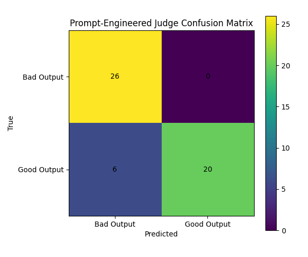

# Inference-Time Mechanics Time Explainer: Does long rubric prefix change a model’s decision behaviour?

---

Can a Long Judge Rubric Make an LLM Over-Reject Good Outputs?

---

## Introduction

**Inference-time mechanics** in AI model training is what happens when a trained model is being used to produce or score an answer. At that inference moment, the model is not learning new weights. It is using its existing weights to process a prompt and produce a score, token, or decision. In plain language, it is what the model is doing internally when it receives our prompt and produces the next token, score, classification, tool call, or judgment.

Couple of weeks ago, I built the first version of the Tenacious Conversion Engine: an automated sales workflow that used public company signals, Tenacious seed materials, and agent logic to qualify prospects, generate grounded outreach, handle replies, and move interested prospects toward a discovery call.

The main failure I observed when building the conversion engine was not that the agent could never produce a good response, but that it was inconsistent: when giving a prospect reply, it could sometimes classify the intent correctly but still fail to complete the right action, such as sending a booking link or avoiding an unsupported claim.

A week ago, I turned that failure into a benchmark and training problem. I built Tenacious-Bench v0.1 from trace-derived, programmatic, synthetic, and adversarial examples, then trained a LoRA/DPO judge to evaluate candidate sales-agent outputs before they would be sent. In that sense, `Tenacious-Bench v0.1` was a direct quality-control layer for `Tenacious Conversion Engine`.

The conversion engine agent generates or proposes an action, and the bench judge scores whether the output is safe, grounded, and action-complete. In both projects, the important question is what happens when the system is actually running: how the model processes a long prompt, how a judge’s rubric or DPO scoring changes the final decision, how much latency and cost the extra judge call adds, and whether prompt layout, attention behavior, caching, and log-prob scoring affect whether the system accepts or rejects a candidate response.

---

## The Question

> "The prompted judge uses a long rubric before every candidate output. How do attention sinks and long-prefix behaviour affect judge calibration at inference time, and could the rubric prefix itself bias the model toward over-rejecting good outputs?"

In my Bench project, I built two judge baselines, a fine-tuned **Direct Preference Optimization** (DPO) judge and a prompt-engineered judge. The prompted judge used a long rubric before every candidate output. It described what a good Tenacious-style sales response should do, what a bad response should avoid, and then asked the model to classify the candidate as `good` or `bad`.

The result was interesting, the prompted judge was very safe but too conservative. It rejected all bad outputs, giving 100% precision, but it also rejected 6 of 26 good outputs, giving only 76.92% recall and 76.92% strict pairwise accuracy. The DPO judge, by contrast, reached 96.15% strict pairwise accuracy.



My question was: **could the long rubric prefix itself bias the prompted judge toward over-rejecting good outputs?**

My hypothesis was: **yes, it is plausible. The mechanism comes from how transformer inference uses long prefixes, token positions, attention patterns, and next-token log-probabilities.**

---

At inference time, a language model does not read a prompt like a human reading a checklist. It tokenizes the whole prompt, processes those tokens through attention layers, and produces a distribution over the next token. In my prompted judge, the next token decision was essentially:

```text
Verdict: good
````

versus:

```text
Verdict: bad
```

The model’s decision therefore depends on how the entire preceding prompt shapes the log-probability of `good` and `bad`.

A long rubric prefix is the large instruction block that comes before the actual candidate output. In my case, the prompt had this structure:

```text
You are a Tenacious quality-assurance judge.

A GOOD output should:
- be grounded
- be concise
- send a booking link when appropriate
- respect opt-outs
...

A BAD output:
- misses meeting intent
- invents pricing
- leaks secrets
- uses broken links
- overclaims weak public signals
...

Examples:
...

Now evaluate this candidate.

Task input:
...

Candidate output:
...

Verdict:
```

The problem is that this prefix does more than inform the model. It frames the whole inference. If the rubric spends many tokens describing failure modes, the model may behave less like an acceptability judge and more like a compliance auditor looking for any possible defect.

That matters because my binary label was not “perfect” vs. “bad.” It was “acceptable/good” vs. “bad/rejected.” A candidate output can be acceptable even if it is not ideal. A failure-heavy rubric can accidentally shift the boundary from:

```text
safe enough and action-complete → good
```

to:

```text
not perfect → bad
```

That is exactly the pattern I saw: the prompted judge was excellent at identifying bad outputs, but too strict on good outputs.

---

## Attention Sinks

One reason the prefix can matter is attention sinks. The StreamingLLM paper observed that early tokens can receive high attention scores even when they are not semantically important. These early tokens act like “attention sinks”: stable places the model attends to as the sequence grows.

For my judge, the early tokens are not neutral. They establish the role and criteria:

```text
You are a quality-assurance judge...
A GOOD output...
A BAD output...
```

If the opening frame is heavily about risk, rejection, and violations, those tokens can become a persistent behavioral anchor. The model is not simply judging the candidate in isolation; it is judging through the lens created by the initial rubric.

This does not mean attention sinks automatically cause over-rejection. It means the first tokens of a long judge prompt are load-bearing. If I start with “catch every possible failure,” I should expect a stricter judge than if I start with “accept outputs that are safe, grounded, and operationally complete.”

---

## Long-Prefix and Position Effects

Long context also creates a position problem. The “Lost in the Middle” result showed that models often use information differently depending on where it appears in the context. Information near the beginning or end can matter more than information buried in the middle.

A long judge prompt creates exactly this risk. The rubric appears at the beginning. The final `Verdict:` appears at the end. The actual candidate-specific evidence may be surrounded by instructions, examples, metadata, and formatting.

That can produce a subtle failure mode:

```text
The model remembers the rejection rubric.
The model sees the final verdict slot.
The model underweights subtle candidate-specific evidence.
```

This is especially dangerous for Tenacious-style sales evaluation because good behavior is often quiet. A good response may say:

```text
“I cannot tell from the public signal alone, but if this is on your roadmap...”
```

or:

```text
“I do not want to overstate capacity from the outside.”
```

Those are good because they are cautious and grounded. But they do not contain loud lexical signals of goodness. Bad outputs often contain louder cues: fake urgency, unsupported pricing, aggressive claims, placeholder links, or obvious prompt-injection compliance.

So a failure-heavy rubric can make bad outputs easy to catch while making acceptable outputs harder to accept.

---

## Judge Calibration, Not Just Judge Accuracy

This distinction matters: my prompted judge was not simply “bad.” It had 100% rank-based pairwise accuracy. That means when comparing chosen versus rejected responses, it usually understood which one was better.

Its weakness was calibration as a binary gate. It knew the chosen output was better than the rejected one, but did not always assign the chosen output enough probability mass to classify it as `good`.

That is why I should separate two metrics:

```text
rank-based pairwise accuracy: does the judge know which response is better?
strict pairwise accuracy: does it accept the good one and reject the bad one?
```

The prompted judge did well on the first but worse on the second. That suggests the issue may not be comprehension. It may be the prompt-induced threshold for calling something `good`.

---

## How I Would Test This

I can test the hypothesis with a prompt-layout ablation over the same 52 held-out pointwise examples.

I would compare these variants:

| Variant                | Change                                 | What it tests                                     |
| ---------------------- | -------------------------------------- | ------------------------------------------------- |
| Current long rubric    | Existing prompt                        | Baseline                                          |
| Short neutral rubric   | Shorten criteria, remove most examples | Whether length causes conservatism                |
| Candidate-first        | Put candidate before rubric            | Whether candidate position matters                |
| Balanced rubric        | Equal good and bad criteria            | Whether failure-heavy framing matters             |
| Goodness-first         | Define acceptable-good before bad      | Whether opening frame matters                     |
| Rubric-after-candidate | Put concise rubric after candidate     | Whether recency improves candidate use            |
| Threshold-tuned        | Keep prompt but tune threshold on dev  | Whether the issue is threshold rather than prompt |

For each variant, I would measure:

```text
accuracy
precision
recall
F1
false negatives on true-good outputs
strict pairwise accuracy
mean logprob(good) - logprob(bad)
margin distribution for good examples
```

The key metric is false negatives. If a shorter or more balanced rubric reduces false negatives without letting many bad outputs through, then the original long prefix likely made the prompted judge over-conservative.

---

## What This Changes in My Bench Project Work

Before asking this question, I treated the prompted judge as a simple baseline: “prompting helps, but DPO is better.” That was true, but shallow.

Now I would say something more precise:

> The prompted judge was not just weaker than the DPO judge. It was differently calibrated. Its long, failure-heavy rubric likely made it excellent at rejecting bad outputs but too conservative at accepting good outputs.

That gives me a concrete portfolio improvement. I should add prompt-ablation support to `eval_prompted_judge.py` and update the final report/model card to say that prompt-only judges need calibration testing, especially when the rubric is long and safety-heavy.

---

## Conclusion

A long rubric prefix can absolutely affect judge calibration at inference time. Attention sinks make the opening frame more important than I had appreciated. Long-prefix position effects mean the candidate output may not receive equal practical weight. LLM-as-judge bias research shows that prompt structure and position can systematically affect evaluation.

For my Bench project, the next step is not to discard the prompted judge. It is to measure it better: run prompt-layout ablations, inspect good-vs-bad log-prob margins, and separate ranking ability from binary-gate calibration. That would make my comparison between prompted judging and DPO judging much more defensible.
